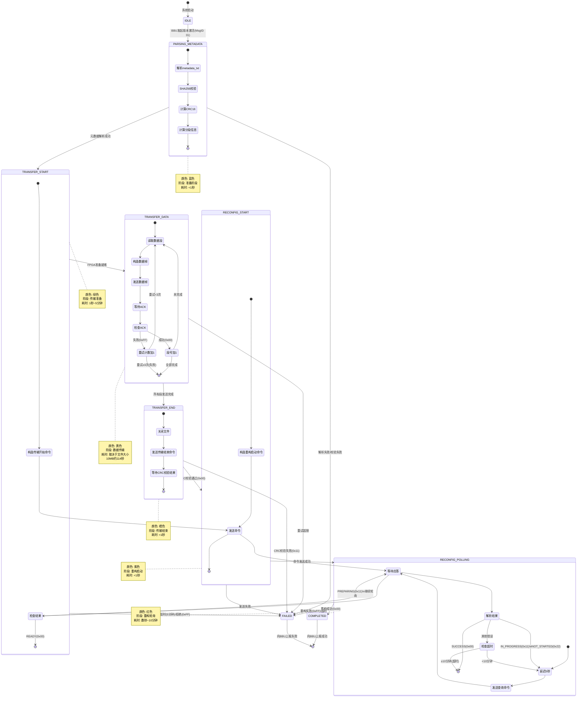
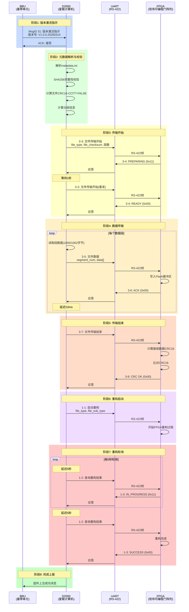

# FPGA固件上注技术文档

**文档版本**: V1.0
**编制日期**: 2026-03-16
**适用系统**: S波段天线管理系统 (D2000星载计算机)
**通信协议**: RS-422 (QNIXY32110-2023规范)
**传输接口**: UART /dev/ttyAMA2 @ 921600 bps, 8N1

---

## 目录

1. [流程梳理](#1-流程梳理)
2. [流程图](#2-流程图)
3. [各阶段函数调用清单](#3-各阶段函数调用清单)
4. [组帧规范](#4-组帧规范)
5. [应答解析](#5-应答解析)
6. [附录](#6-附录)

---

## 1. 流程梳理

### 1.1 完整流程概述

FPGA固件上注流程从BBU发起版本激活指示开始,到FPGA重构完成结束,整个过程涉及BBU、D2000星载计算机和FPGA三方协作。

### 1.2 时序流程详解

#### 阶段0: 固件包准备 (离线)
**时间**: T0
**参与方**: 地面系统
**操作内容**:
1. 准备FPGA固件.bin文件
2. 计算文件SHA256哈希值
3. 创建metadata.txt元数据文件,包含:
   - `file_type`: 文件类型 (0xF0-0xFF)
   - `file_sub_type`: 文件子类型 (0x00-0xFF)
   - `sha256`: SHA256哈希值 (64位十六进制字符串)
   - `version`: 版本号 (如V1.0.0.20260314)
   - `bin_file`: .bin文件名
4. 将固件包上传至D2000的`/opt/vendor/versions/<版本号>/`目录

**输出**: 固件包目录结构
```
/opt/vendor/versions/V1.0.0.20260314/
├── metadata.txt
└── fpga_firmware.bin
```

---

#### 阶段1: BBU发起版本激活 (MsgID 31)
**时间**: T1
**参与方**: BBU → D2000
**通信方式**: TCP/IP (BBU管理面)
**操作内容**:
1. BBU通过TCP连接向D2000发送版本激活指示 (MsgID 31)
2. 消息包含:
   - 目标设备类型 (FPGA)
   - 版本号字符串
   - 激活模式 (立即激活/延迟激活)

**D2000侧处理**:
- 接收并解析MsgID 31消息
- 验证版本号格式
- 检查固件包目录是否存在
- 向BBU返回应答 (接受/拒绝)

**关键函数**: `handle_bbu_version_activate()` (BBU消息处理模块)

---

#### 阶段2: 元数据解析与完整性校验
**时间**: T2 (T1后立即执行)
**参与方**: D2000内部
**状态**: `FPGA_INJ_STATE_PARSING_METADATA`
**操作内容**:

1. **解析metadata.txt**
   - 读取`/opt/vendor/versions/<版本号>/metadata.txt`
   - 解析key=value格式的元数据
   - 提取file_type, file_sub_type, sha256, version, bin_file

2. **SHA256完整性校验**
   - 读取.bin文件全部内容
   - 计算SHA256哈希值
   - 与metadata.txt中的sha256字段比对
   - 校验失败则中止流程

3. **计算文件CRC16-CCITT-FALSE**
   - 读取.bin文件全部内容到内存
   - 使用CRC16-CCITT-FALSE算法计算校验和
   - 初始值: 0xFFFF
   - 多项式: 0x1021
   - 保存校验和用于后续传输开始命令

4. **计算分段信息**
   - 首段大小: 1000字节
   - 其他段大小: 1002字节
   - 总段数计算:
     ```c
     if (file_size <= 1000) {
         total_segments = 1;
     } else {
         remaining = file_size - 1000;
         total_segments = 1 + (remaining + 1001) / 1002;
     }
     ```
   - 最后一段长度计算

**关键函数**: `handle_parsing_metadata()`
**输出**: 元数据结构体 `firmware_metadata_t`, 文件CRC16, 总段数

---

#### 阶段3: 文件传输开始 (RS-422 MsgID 3-3)
**时间**: T3
**参与方**: D2000 → FPGA
**通信方式**: RS-422 UART
**状态**: `FPGA_INJ_STATE_TRANSFER_START`
**操作内容**:

1. **构造传输开始命令帧**
   - 命令码: 0x0155
   - APID: 0x03A0 (控制帧)
   - 载荷参数:
     ```c
     device_id        : uint8_t   // APID高7位
     file_type        : uint8_t   // 0xF0-0xFF
     file_sub_type    : uint8_t   // 0x00-0xFF
     segment_info     : uint16_t  // Bit[15:14]=3(分段), Bit[13:0]=段数
     file_length      : uint32_t  // 文件总长度(字节)
     last_segment_len : uint32_t  // 最后一段长度(字节)
     file_checksum    : uint16_t  // 文件CRC16-CCITT-FALSE
     ```

2. **发送命令并轮询响应**
   - 通过UART发送帧
   - 等待FPGA应答 (MsgID 3-4, 命令码0x015A)
   - 解析应答结果码:
     - `0x00`: READY - 准备就绪,进入下一阶段
     - `0x11`: PREPARING - 准备中,继续轮询(间隔1秒)
     - `0xFF`: REJECTED - 拒绝,流程失败
   - 轮询超时: 5分钟

**关键函数**: `handle_transfer_start()`
**超时处理**: 5分钟无READY响应则失败

---

#### 阶段4: 文件数据传输 (RS-422 MsgID 3-5)
#### 阶段4: 文件数据传输 (RS-422 MsgID 3-5)
**时间**: T4 ~ Tn
**参与方**: D2000 → FPGA
**通信方式**: RS-422 UART
**状态**: `FPGA_INJ_STATE_TRANSFER_DATA`
**操作内容**:

1. **分段读取文件**
   - 打开.bin文件
   - 按段号顺序读取:
     - 第0段: 最多1000字节
     - 第1~N-1段: 最多1002字节
   - 每段读取后立即发送

2. **构造文件数据帧**
   - 命令码: 0x0180
   - APID: 0x03AF (数据帧,低4位必须为0xF)
   - 分组标志 (Grouping Flags):
     - 首段 (segment_num=0): `0b01`
     - 中间段: `0b00`
     - 尾段 (segment_num=total_segments-1): `0b10`
     - 单段 (total_segments=1): `0b11`
   - 载荷:
     ```c
     segment_num : uint16_t  // 段号 (0 ~ total_segments-1)
     data[]      : uint8_t[] // 文件数据 (可变长度)
     ```

3. **发送并等待应答**
   - 发送数据帧
   - 等待FPGA应答 (MsgID 3-6, 命令码0x018A)
   - 解析应答结果码:
     - `0x00`: 接收成功,继续下一段
     - `0xFF`: 接收失败,重试当前段
   - 重试机制:
     - 最大重试次数: 3次
     - 失败后回退文件指针,重新读取并发送
     - 超过重试次数则流程失败

4. **段间延迟**
   - 每段发送成功后延迟10ms
   - 避免FPGA接收缓冲区溢出

5. **进度回调**
   - 每段成功后调用进度回调函数
   - 更新当前段号/总段数

**关键函数**: `handle_transfer_data()`
**循环条件**: 直到所有段发送完成或失败

---

#### 阶段5: 文件传输结束 (RS-422 MsgID 3-7)
**时间**: Tn+1
**参与方**: D2000 → FPGA
**通信方式**: RS-422 UART
**状态**: `FPGA_INJ_STATE_TRANSFER_END`
**操作内容**:

1. **关闭文件**
   - 关闭.bin文件句柄

2. **构造传输结束命令帧**
   - 命令码: 0x01AA
   - APID: 0x03A0 (控制帧)
   - 无载荷参数

3. **发送并等待应答**
   - 发送传输结束命令
   - 等待FPGA应答 (MsgID 3-8, 命令码0x01BB)
   - 解析应答结果码:
     - `0x00`: CRC校验通过,传输完成
     - `0x11`: CRC校验失败,流程失败
   - FPGA侧会对接收到的全部数据计算CRC16-CCITT-FALSE
   - 与传输开始命令中的file_checksum比对

**关键函数**: `handle_transfer_end()`
**成功条件**: FPGA返回CRC校验通过

---

#### 阶段6: FPGA重构启动 (RS-422 MsgID 1-1)
**时间**: Tn+2
**参与方**: D2000 → FPGA
**通信方式**: RS-422 UART
**状态**: `FPGA_INJ_STATE_RECONFIG_START`
**操作内容**:

1. **构造重构启动命令帧**
   - 命令码: 0x01AF
   - APID: 0x03A0 (控制帧)
   - 载荷参数:
     ```c
     file_type     : uint8_t  // 文件类型
     file_sub_type : uint8_t  // 文件子类型
     ```

2. **发送命令**
   - 发送重构启动命令
   - 不等待立即响应 (FPGA开始重构过程)

**关键函数**: `handle_reconfig_start()`
**注意**: 此命令为异步命令,FPGA收到后开始重构,不立即返回结果

---

#### 阶段7: FPGA重构状态轮询 (RS-422 MsgID 1-2)
**时间**: Tn+3 ~ Tm
**参与方**: D2000 → FPGA
**通信方式**: RS-422 UART
**状态**: `FPGA_INJ_STATE_RECONFIG_POLLING`
**操作内容**:

1. **构造重构查询命令帧**
   - 命令码: 0x01C5
   - APID: 0x03A0 (控制帧)
   - 无载荷参数

2. **轮询发送并解析响应**
   - 每5秒发送一次查询命令
   - 等待FPGA应答 (MsgID 1-3, 命令码0x01CA)
   - 解析应答结果码:
     - `0x00`: SUCCESS - 重构成功,流程完成
     - `0x11`: IN_PROGRESS - 重构中,继续轮询
     - `0x22`: NOT_STARTED - 未收到启动指令,继续轮询
     - `0xFF`: FAILED - 重构失败,流程失败
   - 轮询超时: 10分钟

3. **超时处理**
   - 10分钟内未收到SUCCESS响应则失败

**关键函数**: `handle_reconfig_polling()`
**成功条件**: FPGA返回重构成功 (0x00)

---

#### 阶段8: 流程完成
**时间**: Tm+1
**状态**: `FPGA_INJ_STATE_COMPLETED`
**操作内容**:
1. 记录完成时间
2. 清理资源 (关闭文件句柄等)
3. 向BBU上报固件上注成功消息
4. 更新系统状态

**关键函数**: 状态机自动转换

---

### 1.3 异常流程

#### 失败场景1: 元数据解析失败
**触发条件**:
- metadata.txt文件不存在
- metadata.txt格式错误
- 必需字段缺失

**处理**: 转入`FPGA_INJ_STATE_FAILED`状态,向BBU上报失败

---

#### 失败场景2: SHA256校验失败
**触发条件**:
- .bin文件损坏
- 计算的SHA256与metadata.txt不匹配

**处理**: 转入`FPGA_INJ_STATE_FAILED`状态,向BBU上报失败

---

#### 失败场景3: 传输开始超时
**触发条件**:
- 5分钟内FPGA未返回READY状态

**处理**: 转入`FPGA_INJ_STATE_FAILED`状态

---

#### 失败场景4: 数据段传输失败
**触发条件**:
- 单个数据段重试3次仍失败
- UART通信错误

**处理**: 转入`FPGA_INJ_STATE_FAILED`状态

---

#### 失败场景5: CRC校验失败
**触发条件**:
- FPGA侧计算的CRC与D2000发送的不匹配
- 数据传输过程中出现位错误

**处理**: 转入`FPGA_INJ_STATE_FAILED`状态

---

#### 失败场景6: 重构超时
**触发条件**:
- 10分钟内FPGA未返回重构成功

**处理**: 转入`FPGA_INJ_STATE_FAILED`状态

---

### 1.4 时序图总览

```
BBU          D2000                    FPGA
 |             |                        |
 |--MsgID 31-->|                        |  T1: 版本激活指示
 |<---ACK------|                        |
 |             |                        |
 |             |--解析metadata.txt      |  T2: 元数据解析
 |             |--SHA256校验            |
 |             |--计算CRC16             |
 |             |                        |
 |             |---3-3: 传输开始------->|  T3: 传输开始
 |             |<--3-4: PREPARING-------|
 |             |---3-3: 传输开始------->|  (轮询)
 |             |<--3-4: READY-----------|
 |             |                        |
 |             |---3-5: 数据段0-------->|  T4: 数据传输
 |             |<--3-6: ACK-------------|
 |             |---3-5: 数据段1-------->|
 |             |<--3-6: ACK-------------|
 |             |        ...             |
 |             |---3-5: 数据段N-------->|  Tn
 |             |<--3-6: ACK-------------|
 |             |                        |
 |             |---3-7: 传输结束------->|  Tn+1: 传输结束
 |             |<--3-8: CRC OK----------|
 |             |                        |
 |             |---1-1: 重构启动------->|  Tn+2: 重构启动
 |             |                        |
 |             |---1-2: 查询重构------->|  Tn+3: 轮询重构状态
 |             |<--1-3: IN_PROGRESS-----|
 |             |        (延迟5秒)       |
 |             |---1-2: 查询重构------->|
 |             |<--1-3: IN_PROGRESS-----|
 |             |        ...             |
 |             |---1-2: 查询重构------->|  Tm
 |             |<--1-3: SUCCESS---------|
 |             |                        |
 |<--上报成功--|                        |  Tm+1: 完成
 |             |                        |
```

---

## 2. 流程图

### 2.1 Mermaid流程图



### 2.2 泳道图 (Swimlane Diagram)



### 2.3 图例说明

| 颜色 | 阶段 | 说明 | 典型耗时 |
|------|------|------|----------|
| 🔵 蓝色 | 元数据解析 | D2000内部处理,解析元数据并校验 | <1秒 |
| 🟢 绿色 | 传输准备 | 等待FPGA准备接收,可能需要轮询 | 1秒~5分钟 |
| 🟡 黄色 | 数据传输 | 分段传输固件数据,主要耗时阶段 | 取决于文件大小 |
| 🟠 橙色 | 传输结束 | FPGA进行CRC校验 | <1秒 |
| 🟣 紫色 | 重构启动 | 发送重构命令,FPGA开始重构 | <1秒 |
| 🔴 红色 | 重构轮询 | 轮询FPGA重构状态,直到完成 | 数秒~10分钟 |
| ⚪ 白色 | 空闲/完成 | 初始状态或最终状态 | - |
| ⚫ 黑色 | 失败 | 任何阶段失败后的终止状态 | - |

---

## 3. 各阶段函数调用清单

### 3.1 D2000侧函数调用表

#### 3.1.1 初始化阶段

| 函数名 | 文件位置 | 参数列表 | 返回值 | 异常码 | 说明 |
|--------|----------|----------|--------|--------|------|
| `fpga_firmware_injection_init` | fpga_firmware_injector.c | `uart_rs422_client_t *uart_client` | `int` | `SUCCESS(0)`<br/>`ERROR_INVALID_PARAM(-2)` | 初始化FPGA固件注入器,传入UART客户端指针 |
| `uart_rs422_init` | uart_rs422_client.c | `uart_rs422_client_t *client`<br/>`const char *device_path` | `int` | `SUCCESS(0)`<br/>`ERROR_INVALID_PARAM(-2)` | 初始化UART RS-422客户端,设备路径为`/dev/ttyAMA2` |
| `uart_rs422_open` | uart_rs422_client.c | `uart_rs422_client_t *client` | `int` | `SUCCESS(0)`<br/>`ERROR_GENERAL(-1)` | 打开UART设备,配置波特率921600,8N1 |
| `rs422_protocol_init` | rs422_protocol.c | `void` | `int` | `SUCCESS(0)` | 初始化RS-422协议层,重置序列计数器 |
| `firmware_package_init` | firmware_package.c | `void` | `int` | `SUCCESS(0)` | 初始化固件包解析模块 |

---

#### 3.1.2 启动注入任务

| 函数名 | 文件位置 | 参数列表 | 返回值 | 异常码 | 说明 |
|--------|----------|----------|--------|--------|------|
| `fpga_firmware_injection_start` | fpga_firmware_injector.c | `const char *version_dir`<br/>`const char *version_num` | `int` | `SUCCESS(0)`<br/>`ERROR_INVALID_PARAM(-2)`<br/>`ERROR_GENERAL(-1)` | 启动固件注入任务,创建后台线程执行状态机 |

**参数说明**:
- `version_dir`: 版本目录路径,如`/opt/vendor/versions/V1.0.0.20260314`
- `version_num`: 版本号字符串,如`V1.0.0.20260314`

**调用示例**:
```c
int ret = fpga_firmware_injection_start(
    "/opt/vendor/versions/V1.0.0.20260314",
    "V1.0.0.20260314"
);
if (ret != SUCCESS) {
    LOG_ERROR("启动FPGA固件注入失败");
}
```

---

#### 3.1.3 阶段2: 元数据解析 (状态机内部)

| 函数名 | 文件位置 | 参数列表 | 返回值 | 异常码 | 说明 |
|--------|----------|----------|--------|--------|------|
| `handle_parsing_metadata` | fpga_firmware_injector.c | `fpga_injection_task_t *task` | `int` | `SUCCESS(0)`<br/>`ERROR_GENERAL(-1)` | 解析元数据,校验SHA256,计算CRC16和分段信息 |
| `firmware_parse_metadata` | firmware_package.c | `const char *version_dir`<br/>`firmware_metadata_t *metadata` | `int` | `SUCCESS(0)`<br/>`ERROR_INVALID_PARAM(-2)`<br/>`ERROR_GENERAL(-1)` | 解析metadata.txt文件,提取元数据字段 |
| `firmware_verify_integrity` | firmware_package.c | `const char *bin_file_path`<br/>`const char *expected_sha256` | `int` | `SUCCESS(0)`<br/>`ERROR_INVALID_PARAM(-2)`<br/>`ERROR_GENERAL(-1)` | 计算.bin文件SHA256并与期望值比对 |
| `firmware_get_file_size` | firmware_package.c | `const char *bin_file_path`<br/>`uint32_t *file_size` | `int` | `SUCCESS(0)`<br/>`ERROR_INVALID_PARAM(-2)`<br/>`ERROR_GENERAL(-1)` | 获取.bin文件大小(字节) |
| `rs422_crc16_ccitt_false` | rs422_protocol.c | `const uint8_t *data`<br/>`uint32_t len` | `uint16_t` | N/A | 计算CRC16-CCITT-FALSE校验和 |

**关键逻辑**:
```c
// 计算总段数
if (file_size <= FPGA_FIRST_SEGMENT_SIZE) {  // 1000字节
    total_segments = 1;
} else {
    uint32_t remaining = file_size - FPGA_FIRST_SEGMENT_SIZE;
    total_segments = 1 + (remaining + FPGA_OTHER_SEGMENT_SIZE - 1) / FPGA_OTHER_SEGMENT_SIZE;
}

// 计算文件CRC16
uint8_t *file_data = malloc(file_size);
fread(file_data, 1, file_size, fp);
uint16_t file_crc = rs422_crc16_ccitt_false(file_data, file_size);
free(file_data);
```

---

#### 3.1.4 阶段3: 传输开始

| 函数名 | 文件位置 | 参数列表 | 返回值 | 异常码 | 说明 |
|--------|----------|----------|--------|--------|------|
| `handle_transfer_start` | fpga_firmware_injector.c | `fpga_injection_task_t *task` | `int` | `SUCCESS(0)`<br/>`ERROR_GENERAL(-1)`<br/>`ERROR_TIMEOUT(-5)` | 发送传输开始命令并轮询FPGA准备状态 |
| `rs422_build_transfer_start` | rs422_protocol.c | `const rs422_cmd_transfer_start_t *params`<br/>`uint8_t *frame_buf`<br/>`uint32_t frame_buf_size` | `int` | `>0`: 帧长度<br/>`<0`: 错误码 | 构造传输开始命令帧(MsgID 3-3) |
| `uart_rs422_send_and_wait` | uart_rs422_client.c | `uart_rs422_client_t *client`<br/>`const uint8_t *send_frame`<br/>`uint32_t send_len`<br/>`uint8_t *recv_frame`<br/>`uint32_t recv_buf_size`<br/>`uint32_t *recv_len`<br/>`uint16_t expected_cmd` | `int` | `SUCCESS(0)`<br/>`ERROR_TIMEOUT(-5)`<br/>`ERROR_GENERAL(-1)` | 发送帧并等待指定命令码的响应 |
| `rs422_decode_frame` | rs422_protocol.c | `const uint8_t *frame_buf`<br/>`uint32_t frame_len`<br/>`uint16_t *apid`<br/>`uint16_t *cmd_code`<br/>`const uint8_t **payload`<br/>`uint32_t *payload_len` | `int` | `SUCCESS(0)`<br/>`ERROR_INVALID_PARAM(-2)`<br/>`ERROR_GENERAL(-1)` | 解码RS-422帧,提取APID、命令码和载荷 |
| `rs422_parse_transfer_start_ack` | rs422_protocol.c | `const uint8_t *payload`<br/>`uint32_t payload_len`<br/>`uint8_t *result` | `int` | `SUCCESS(0)`<br/>`ERROR_INVALID_PARAM(-2)` | 解析传输开始应答(MsgID 3-4),提取结果码 |

**轮询逻辑**:
```c
time_t start_time = time(NULL);
uint8_t result = RS422_TRANSFER_PREPARING;

while (result == RS422_TRANSFER_PREPARING) {
    // 检查超时(5分钟)
    if ((time(NULL) - start_time) > 300) {
        return ERROR_TIMEOUT;
    }

    // 发送命令并等待应答
    uart_rs422_send_and_wait(...);
    rs422_parse_transfer_start_ack(payload, payload_len, &result);

    if (result == RS422_TRANSFER_PREPARING) {
        sleep(1);  // 等待1秒后重试
    }
}

if (result != RS422_TRANSFER_READY) {
    return ERROR_GENERAL;  // FPGA拒绝
}
```

---

#### 3.1.5 阶段4: 数据传输

| 函数名 | 文件位置 | 参数列表 | 返回值 | 异常码 | 说明 |
|--------|----------|----------|--------|--------|------|
| `handle_transfer_data` | fpga_firmware_injector.c | `fpga_injection_task_t *task` | `int` | `SUCCESS(0)`<br/>`ERROR_GENERAL(-1)` | 循环发送所有数据段,每段发送后等待ACK |
| `rs422_build_file_data` | rs422_protocol.c | `uint16_t segment_num`<br/>`const uint8_t *data`<br/>`uint32_t data_len`<br/>`uint8_t *frame_buf`<br/>`uint32_t frame_buf_size`<br/>`uint32_t total_segments` | `int` | `>0`: 帧长度<br/>`<0`: 错误码 | 构造文件数据帧(MsgID 3-5),自动设置分组标志 |
| `rs422_parse_data_ack` | rs422_protocol.c | `const uint8_t *payload`<br/>`uint32_t payload_len`<br/>`uint8_t *result` | `int` | `SUCCESS(0)`<br/>`ERROR_INVALID_PARAM(-2)` | 解析数据接收应答(MsgID 3-6),提取结果码 |

**循环逻辑**:
```c
while (current_segment < total_segments) {
    // 确定当前段大小
    uint32_t segment_size = (current_segment == 0) ?
        FPGA_FIRST_SEGMENT_SIZE : FPGA_OTHER_SEGMENT_SIZE;

    // 读取数据段
    size_t bytes_read = fread(data_buf, 1, segment_size, bin_fp);

    // 构造并发送数据帧
    int frame_len = rs422_build_file_data(current_segment, data_buf,
                                           bytes_read, frame_buf,
                                           sizeof(frame_buf), total_segments);

    // 发送并等待ACK
    int ret = uart_rs422_send_and_wait(...);

    if (ret != SUCCESS || result != RS422_DATA_RECEIVED_OK) {
        // 重试逻辑
        retry_count++;
        if (retry_count >= 3) {
            return ERROR_GENERAL;  // 失败
        }
        fseek(bin_fp, -(long)bytes_read, SEEK_CUR);  // 回退
        continue;
    }

    // 成功,继续下一段
    current_segment++;
    retry_count = 0;
    usleep(10000);  // 延迟10ms
}
```

---

#### 3.1.6 阶段5: 传输结束

| 函数名 | 文件位置 | 参数列表 | 返回值 | 异常码 | 说明 |
|--------|----------|----------|--------|--------|------|
| `handle_transfer_end` | fpga_firmware_injector.c | `fpga_injection_task_t *task` | `int` | `SUCCESS(0)`<br/>`ERROR_GENERAL(-1)` | 发送传输结束命令,等待FPGA CRC校验结果 |
| `rs422_build_transfer_end` | rs422_protocol.c | `uint8_t *frame_buf`<br/>`uint32_t frame_buf_size` | `int` | `>0`: 帧长度<br/>`<0`: 错误码 | 构造传输结束命令帧(MsgID 3-7) |
| `rs422_parse_transfer_end_ack` | rs422_protocol.c | `const uint8_t *payload`<br/>`uint32_t payload_len`<br/>`uint8_t *result` | `int` | `SUCCESS(0)`<br/>`ERROR_INVALID_PARAM(-2)` | 解析传输结束应答(MsgID 3-8),提取CRC校验结果 |

---

#### 3.1.7 阶段6: 重构启动

| 函数名 | 文件位置 | 参数列表 | 返回值 | 异常码 | 说明 |
|--------|----------|----------|--------|--------|------|
| `handle_reconfig_start` | fpga_firmware_injector.c | `fpga_injection_task_t *task` | `int` | `SUCCESS(0)`<br/>`ERROR_GENERAL(-1)` | 发送重构启动命令(MsgID 1-1) |
| `rs422_build_reconfig_start` | rs422_protocol.c | `uint8_t file_type`<br/>`uint8_t file_sub_type`<br/>`uint8_t *frame_buf`<br/>`uint32_t frame_buf_size` | `int` | `>0`: 帧长度<br/>`<0`: 错误码 | 构造重构启动命令帧 |
| `uart_rs422_send_frame` | uart_rs422_client.c | `uart_rs422_client_t *client`<br/>`const uint8_t *frame`<br/>`uint32_t frame_len` | `int` | `SUCCESS(0)`<br/>`ERROR_GENERAL(-1)` | 发送帧(不等待响应) |

---

#### 3.1.8 阶段7: 重构轮询

| 函数名 | 文件位置 | 参数列表 | 返回值 | 异常码 | 说明 |
|--------|----------|----------|--------|--------|------|
| `handle_reconfig_polling` | fpga_firmware_injector.c | `fpga_injection_task_t *task` | `int` | `SUCCESS(0)`<br/>`ERROR_GENERAL(-1)`<br/>`ERROR_TIMEOUT(-5)` | 轮询FPGA重构状态,每5秒查询一次 |
| `rs422_build_reconfig_query` | rs422_protocol.c | `uint8_t *frame_buf`<br/>`uint32_t frame_buf_size` | `int` | `>0`: 帧长度<br/>`<0`: 错误码 | 构造重构查询命令帧(MsgID 1-2) |
| `rs422_parse_reconfig_ack` | rs422_protocol.c | `const uint8_t *payload`<br/>`uint32_t payload_len`<br/>`uint8_t *result` | `int` | `SUCCESS(0)`<br/>`ERROR_INVALID_PARAM(-2)` | 解析重构结果应答(MsgID 1-3),提取结果码 |

**轮询逻辑**:
```c
time_t start_time = time(NULL);

while (true) {
    // 检查超时(10分钟)
    if ((time(NULL) - start_time) > 600) {
        return ERROR_TIMEOUT;
    }

    sleep(5);  // 延迟5秒

    // 发送查询命令
    rs422_build_reconfig_query(...);
    uart_rs422_send_and_wait(...);
    rs422_parse_reconfig_ack(payload, payload_len, &result);

    if (result == RS422_RECONFIG_SUCCESS) {
        return SUCCESS;  // 重构成功
    } else if (result == RS422_RECONFIG_FAILED) {
        return ERROR_GENERAL;  // 重构失败
    }
    // IN_PROGRESS或NOT_STARTED: 继续轮询
}
```

---

#### 3.1.9 进度查询与控制

| 函数名 | 文件位置 | 参数列表 | 返回值 | 异常码 | 说明 |
|--------|----------|----------|--------|--------|------|
| `fpga_firmware_injection_get_progress` | fpga_firmware_injector.c | `uint32_t *current`<br/>`uint32_t *total`<br/>`fpga_injection_state_t *state` | `int` | `SUCCESS(0)` | 获取当前注入进度(当前段号/总段数)和状态 |
| `fpga_firmware_injection_abort` | fpga_firmware_injector.c | `void` | `int` | `SUCCESS(0)` | 请求中止注入任务 |
| `fpga_firmware_injection_wait` | fpga_firmware_injector.c | `uint32_t timeout_sec` | `int` | `SUCCESS(0)`<br/>`ERROR_TIMEOUT(-5)` | 等待注入完成,0表示无限等待 |
| `fpga_injection_get_state_name` | fpga_firmware_injector.c | `fpga_injection_state_t state` | `const char*` | N/A | 获取状态名称字符串(用于日志) |

---

#### 3.1.10 清理阶段

| 函数名 | 文件位置 | 参数列表 | 返回值 | 异常码 | 说明 |
|--------|----------|----------|--------|--------|------|
| `fpga_firmware_injection_cleanup` | fpga_firmware_injector.c | `void` | `void` | N/A | 清理FPGA固件注入器资源 |
| `uart_rs422_close` | uart_rs422_client.c | `uart_rs422_client_t *client` | `void` | N/A | 关闭UART设备 |
| `rs422_protocol_cleanup` | rs422_protocol.c | `void` | `void` | N/A | 清理RS-422协议层 |
| `firmware_package_cleanup` | firmware_package.c | `void` | `void` | N/A | 清理固件包解析模块 |

---

### 3.2 函数调用关系图

```
fpga_firmware_injection_start()
    └─> pthread_create(injection_thread_func)
            └─> 状态机循环
                    ├─> handle_parsing_metadata()
                    │       ├─> firmware_parse_metadata()
                    │       ├─> firmware_verify_integrity()
                    │       ├─> firmware_get_file_size()
                    │       └─> rs422_crc16_ccitt_false()
                    │
                    ├─> handle_transfer_start()
                    │       ├─> rs422_build_transfer_start()
                    │       ├─> uart_rs422_send_and_wait()
                    │       ├─> rs422_decode_frame()
                    │       └─> rs422_parse_transfer_start_ack()
                    │
                    ├─> handle_transfer_data()
                    │       ├─> fread()
                    │       ├─> rs422_build_file_data()
                    │       ├─> uart_rs422_send_and_wait()
                    │       ├─> rs422_decode_frame()
                    │       └─> rs422_parse_data_ack()
                    │
                    ├─> handle_transfer_end()
                    │       ├─> rs422_build_transfer_end()
                    │       ├─> uart_rs422_send_and_wait()
                    │       ├─> rs422_decode_frame()
                    │       └─> rs422_parse_transfer_end_ack()
                    │
                    ├─> handle_reconfig_start()
                    │       ├─> rs422_build_reconfig_start()
                    │       └─> uart_rs422_send_frame()
                    │
                    └─> handle_reconfig_polling()
                            ├─> rs422_build_reconfig_query()
                            ├─> uart_rs422_send_and_wait()
                            ├─> rs422_decode_frame()
                            └─> rs422_parse_reconfig_ack()
```

---
## 4. 组帧规范

### 4.1 RS-422帧结构总览

RS-422帧遵循QNIXY32110-2023规范,采用Big-Endian字节序。

```
+----------------+----------------+------------------+------------------+
|   标识符(2B)   |   包标识(2B)   | 包序列控制(2B)   | 数据域长度(2B)   |
+----------------+----------------+------------------+------------------+
|                          数据域(可变长度)                            |
+----------------------------------------------------------------------+
|                          校验和(2B)                                  |
+----------------------------------------------------------------------+
```

### 4.2 帧头字段详解

#### 4.2.1 标识符 (Sync Word)
- **字节偏移**: 0-1
- **长度**: 2字节
- **值**: `0xEB90` (固定)
- **字节序**: Big-Endian
- **说明**: 帧同步字,用于帧边界检测

**C语言表示**:
```c
uint16_t sync = 0xEB90;
uint16_t sync_be = htons(sync);  // 转换为Big-Endian
memcpy(frame_buf, &sync_be, 2);
```

---

#### 4.2.2 包标识 (Packet ID)
- **字节偏移**: 2-3
- **长度**: 2字节 (16位)
- **字节序**: Big-Endian
- **位域结构**:

```
Bit 15-13: 版本号 (Version Number)
    000 = 版本0 (当前使用)

Bit 12: 类型 (Type)
    0 = 遥测 (Telemetry)
    1 = 遥控 (Telecommand)

Bit 11: 副导头标识 (Secondary Header Flag)
    0 = 无副导头
    1 = 有副导头

Bit 10-0: APID (Application Process Identifier)
    11位应用标识符
    控制帧: 0x03A0 (示例)
    数据帧: 0x03AF (低4位必须为0xF)
```

**位域计算**:
```c
// 控制帧APID示例
uint16_t apid = 0x03A0;
uint16_t packet_id = (0b000 << 13) |  // 版本号=0
                     (0b0 << 12) |     // 类型=0
                     (0b0 << 11) |     // 副导头=0
                     (apid & 0x07FF);  // APID低11位
uint16_t packet_id_be = htons(packet_id);
```

**APID定义**:
| APID | 十六进制 | 用途 | 说明 |
|------|----------|------|------|
| 控制帧APID | 0x03A0 | 控制指令 | 用于传输开始、传输结束、重构启动等命令 |
| 数据帧APID | 0x03AF | 文件数据 | 用于文件数据传输,低4位必须为0xF |

---

#### 4.2.3 包序列控制 (Packet Sequence Control)
- **字节偏移**: 4-5
- **长度**: 2字节 (16位)
- **字节序**: Big-Endian
- **位域结构**:

```
Bit 15-14: 分组标志 (Grouping Flags)
    11 = 单帧 (Unsegmented)         - 用于控制指令
    01 = 首段 (First Segment)       - 文件数据首段
    00 = 中间段 (Continuation)      - 文件数据中间段
    10 = 尾段 (Last Segment)        - 文件数据尾段

Bit 13-0: 源包序列计数 (Source Sequence Count)
    14位序列计数器,每帧递增
    范围: 0 ~ 16383
```

**分组标志使用规则**:
| 帧类型 | 分组标志 | 使用场景 |
|--------|----------|----------|
| 控制指令 | `0b11` | 传输开始、传输结束、重构启动、重构查询等 |
| 文件数据(单段) | `0b11` | 文件大小≤1000字节,只需1段 |
| 文件数据(首段) | `0b01` | 多段传输的第0段 |
| 文件数据(中间段) | `0b00` | 多段传输的第1~N-2段 |
| 文件数据(尾段) | `0b10` | 多段传输的第N-1段 |

**序列计数器管理**:
```c
static uint16_t g_seq_counter = 0;  // 全局序列计数器

// 构造包序列控制字段
uint16_t group_flags = 0b11;  // 单帧(控制指令)
uint16_t seq_ctrl = (group_flags << 14) | (g_seq_counter & 0x3FFF);
g_seq_counter++;  // 每帧递增
uint16_t seq_ctrl_be = htons(seq_ctrl);
```

---

#### 4.2.4 数据域长度 (Data Length)
- **字节偏移**: 6-7
- **长度**: 2字节
- **字节序**: Big-Endian
- **计算公式**: `数据域长度 = 包数据长度 - 1`
- **包数据**: 命令码(2字节) + 载荷(可变长度)

**示例计算**:
```c
// 示例: 传输开始命令
// 命令码: 2字节
// 载荷: 15字节
uint16_t data_len = (2 + 15) - 1 = 16;
uint16_t data_len_be = htons(data_len);
```

---

### 4.3 数据域结构

数据域包含命令码和载荷:

```
+------------------+----------------------------------+
|   命令码(2B)     |        载荷(可变长度)            |
+------------------+----------------------------------+
```

#### 4.3.1 命令码 (Command Code)
- **长度**: 2字节
- **字节序**: Big-Endian
- **定义**: 见下表

| 命令码 | 十六进制 | MsgID | 方向 | 说明 |
|--------|----------|-------|------|------|
| 重构启动 | 0x01AF | 1-1 | D2000→FPGA | 启动FPGA重构 |
| 重构查询 | 0x01C5 | 1-2 | D2000→FPGA | 查询重构结果 |
| 重构应答 | 0x01CA | 1-3 | FPGA→D2000 | 重构结果应答 |
| 版本查询 | 0x0101 | 1-4 | D2000→FPGA | 查询固件版本 |
| 版本应答 | 0x0108 | 1-5 | FPGA→D2000 | 版本应答 |
| 传输开始 | 0x0155 | 3-3 | D2000→FPGA | 文件传输开始 |
| 传输开始应答 | 0x015A | 3-4 | FPGA→D2000 | 传输开始应答 |
| 文件数据 | 0x0180 | 3-5 | D2000→FPGA | 文件数据帧 |
| 数据应答 | 0x018A | 3-6 | FPGA→D2000 | 数据接收应答 |
| 传输结束 | 0x01AA | 3-7 | D2000→FPGA | 文件传输结束 |
| 传输结束应答 | 0x01BB | 3-8 | FPGA→D2000 | 传输结束应答 |
| 传输中止 | 0x018F | 3-9 | D2000→FPGA | 传输异常中止 |
| 中止应答 | 0x018E | 3-10 | FPGA→D2000 | 中止应答 |

---

#### 4.3.2 载荷 (Payload)
载荷内容根据命令码不同而不同,详见各命令帧格式。

---

### 4.4 校验和 (Checksum)
- **字节偏移**: 帧尾
- **长度**: 2字节
- **字节序**: Big-Endian
- **算法**: 单字节累加求和取反,取低16位
- **计算范围**: 包主导头(不含标识符) + 数据域
- **说明**: 从字节偏移2开始(跳过标识符0xEB90),到数据域结束

**算法实现**:
```c
uint16_t rs422_checksum(const uint8_t *data, uint32_t len)
{
    uint32_t sum = 0;

    // 单字节累加求和
    for (uint32_t i = 0; i < len; i++) {
        sum += data[i];
    }

    // 取反,取低16位
    return (uint16_t)(~sum & 0xFFFF);
}

// 使用示例
uint16_t checksum = rs422_checksum(frame_buf + 2, offset - 2);
uint16_t checksum_be = htons(checksum);
memcpy(frame_buf + offset, &checksum_be, 2);
```

**注意**:
- 校验和计算**不包含**标识符(0xEB90)
- 校验和计算**包含**包标识、包序列控制、数据域长度、命令码和载荷
- 校验和本身**不参与**计算

---

### 4.5 各命令帧格式详解

#### 4.5.1 传输开始命令 (MsgID 3-3)

**帧结构**:
```
+--------+--------+--------+--------+--------+--------+--------+--------+
| 0xEB90 | PktID  | SeqCtrl| DataLen| 0x0155 |      Payload (15字节)      |
+--------+--------+--------+--------+--------+--------+--------+--------+
|                          Checksum                                      |
+------------------------------------------------------------------------+
```

**载荷结构** (15字节):
```c
typedef struct __attribute__((packed)) {
    uint8_t  device_id;          // 设备标识 (APID高7位)
    uint8_t  file_type;          // 文件类型 (0xF0-0xFF)
    uint8_t  file_sub_type;      // 文件子类型 (0x00-0xFF)
    uint16_t segment_info;       // 分段信息 (Big-Endian)
                                 // Bit[15:14]=是否分段 (0=否,3=是)
                                 // Bit[13:0]=段数
    uint32_t file_length;        // 文件总长度 (Big-Endian)
    uint32_t last_segment_len;   // 最后一段长度 (Big-Endian)
    uint16_t file_checksum;      // 文件CRC16-CCITT-FALSE (Big-Endian)
} rs422_cmd_transfer_start_t;
```

**字段说明**:
- `device_id`: APID的高7位,用于设备标识
- `file_type`: 文件类型,范围0xF0-0xFF
- `file_sub_type`: 文件子类型,范围0x00-0xFF
- `segment_info`:
  - Bit[15:14]: 是否分段标志
    - `0b00`: 不分段 (文件≤1000字节)
    - `0b11`: 分段传输 (文件>1000字节)
  - Bit[13:0]: 总段数 (1~16383)
- `file_length`: 文件总长度(字节)
- `last_segment_len`: 最后一段的长度(字节)
- `file_checksum`: 整个文件的CRC16-CCITT-FALSE校验和

**构造示例**:
```c
rs422_cmd_transfer_start_t params;
params.device_id = (RS422_APID_CONTROL >> 4) & 0x7F;
params.file_type = 0xFF;
params.file_sub_type = 0x00;
params.segment_info = htons((3 << 14) | total_segments);
params.file_length = htonl(file_size);
params.last_segment_len = htonl(last_seg_len);
params.file_checksum = htons(file_crc16);
```

---

#### 4.5.2 传输开始应答 (MsgID 3-4)

**帧结构**:
```
+--------+--------+--------+--------+--------+--------+--------+
| 0xEB90 | PktID  | SeqCtrl| DataLen| 0x015A | Result | Checksum|
+--------+--------+--------+--------+--------+--------+--------+
```

**载荷结构** (1字节):
```c
typedef struct __attribute__((packed)) {
    uint8_t result;  // 结果码
} rs422_cmd_transfer_start_ack_t;
```

**结果码定义**:
| 结果码 | 十六进制 | 含义 | 后续动作 |
|--------|----------|------|----------|
| READY | 0x00 | 准备就绪 | 开始数据传输 |
| PREPARING | 0x11 | 准备中 | 继续轮询(间隔1秒) |
| REJECTED | 0xFF | 拒绝/异常 | 流程失败 |

---

#### 4.5.3 文件数据帧 (MsgID 3-5)

**帧结构**:
```
+--------+--------+--------+--------+--------+--------+--------+--------+
| 0xEB90 | PktID  | SeqCtrl| DataLen| 0x0180 | SegNum |   Data (可变)   |
+--------+--------+--------+--------+--------+--------+--------+--------+
|                          Checksum                                      |
+------------------------------------------------------------------------+
```

**载荷结构**:
```c
typedef struct __attribute__((packed)) {
    uint16_t segment_num;  // 段号 (Big-Endian, 0 ~ total_segments-1)
    uint8_t  data[];       // 文件数据 (可变长度)
} rs422_cmd_file_data_t;
```

**分包大小规则**:
| 段号 | 最大数据长度 | 说明 |
|------|--------------|------|
| 第0段 | 1000字节 | 首段 |
| 第1~N-1段 | 1002字节 | 其他段 |

**分组标志设置**:
```c
uint16_t group_flags;
if (total_segments == 1) {
    group_flags = 0b11;  // 单帧
} else if (segment_num == 0) {
    group_flags = 0b01;  // 首段
} else if (segment_num == total_segments - 1) {
    group_flags = 0b10;  // 尾段
} else {
    group_flags = 0b00;  // 中间段
}
```

**APID设置**:
- 文件数据帧必须使用数据帧APID
- 数据帧APID的低4位必须为`0xF`
- 示例: `0x03AF`

---

#### 4.5.4 数据接收应答 (MsgID 3-6)

**帧结构**:
```
+--------+--------+--------+--------+--------+--------+--------+
| 0xEB90 | PktID  | SeqCtrl| DataLen| 0x018A | Result | Checksum|
+--------+--------+--------+--------+--------+--------+--------+
```

**载荷结构** (1字节):
```c
typedef struct __attribute__((packed)) {
    uint8_t result;  // 结果码
} rs422_cmd_data_ack_t;
```

**结果码定义**:
| 结果码 | 十六进制 | 含义 | 后续动作 |
|--------|----------|------|----------|
| RECEIVED_OK | 0x00 | 接收成功 | 继续下一段 |
| RECEIVED_ERROR | 0xFF | 接收失败 | 重试当前段(最多3次) |

---

#### 4.5.5 传输结束命令 (MsgID 3-7)

**帧结构**:
```
+--------+--------+--------+--------+--------+--------+
| 0xEB90 | PktID  | SeqCtrl| DataLen| 0x01AA | Checksum|
+--------+--------+--------+--------+--------+--------+
```

**载荷**: 无载荷

---

#### 4.5.6 传输结束应答 (MsgID 3-8)

**帧结构**:
```
+--------+--------+--------+--------+--------+--------+--------+
| 0xEB90 | PktID  | SeqCtrl| DataLen| 0x01BB | Result | Checksum|
+--------+--------+--------+--------+--------+--------+--------+
```

**载荷结构** (1字节):
```c
typedef struct __attribute__((packed)) {
    uint8_t result;  // 结果码
} rs422_cmd_transfer_end_ack_t;
```

**结果码定义**:
| 结果码 | 十六进制 | 含义 | 说明 |
|--------|----------|------|------|
| COMPLETE_OK | 0x00 | CRC校验通过 | 传输完成,进入重构阶段 |
| COMPLETE_ERROR | 0x11 | CRC校验失败 | 流程失败 |

**CRC校验说明**:
- FPGA侧对接收到的全部数据计算CRC16-CCITT-FALSE
- 与传输开始命令中的`file_checksum`字段比对
- 校验通过则返回0x00,失败则返回0x11

---

#### 4.5.7 重构启动命令 (MsgID 1-1)

**帧结构**:
```
+--------+--------+--------+--------+--------+--------+--------+--------+
| 0xEB90 | PktID  | SeqCtrl| DataLen| 0x01AF | FileType| SubType| Checksum|
+--------+--------+--------+--------+--------+--------+--------+--------+
```

**载荷结构** (2字节):
```c
typedef struct __attribute__((packed)) {
    uint8_t file_type;      // 文件类型 (0xF0-0xFF)
    uint8_t file_sub_type;  // 文件子类型 (0x00-0xFF)
} rs422_cmd_reconfig_start_t;
```

---

#### 4.5.8 重构查询命令 (MsgID 1-2)

**帧结构**:
```
+--------+--------+--------+--------+--------+--------+
| 0xEB90 | PktID  | SeqCtrl| DataLen| 0x01C5 | Checksum|
+--------+--------+--------+--------+--------+--------+
```

**载荷**: 无载荷

---

#### 4.5.9 重构结果应答 (MsgID 1-3)

**帧结构**:
```
+--------+--------+--------+--------+--------+--------+--------+
| 0xEB90 | PktID  | SeqCtrl| DataLen| 0x01CA | Result | Checksum|
+--------+--------+--------+--------+--------+--------+--------+
```

**载荷结构** (1字节):
```c
typedef struct __attribute__((packed)) {
    uint8_t result;  // 结果码
} rs422_cmd_reconfig_ack_t;
```

**结果码定义**:
| 结果码 | 十六进制 | 含义 | 后续动作 |
|--------|----------|------|----------|
| SUCCESS | 0x00 | 重构成功 | 流程完成 |
| IN_PROGRESS | 0x11 | 重构中 | 继续轮询(间隔5秒) |
| NOT_STARTED | 0x22 | 未收到启动指令 | 继续轮询 |
| FAILED | 0xFF | 重构失败 | 流程失败 |

---

### 4.6 CRC16-CCITT-FALSE算法

**用途**: 文件完整性校验

**参数**:
- 初始值: `0xFFFF`
- 多项式: `0x1021`
- 输入反转: 否
- 输出反转: 否
- 异或输出: 否

**算法实现**:
```c
uint16_t rs422_crc16_ccitt_false(const uint8_t *data, uint32_t len)
{
    uint16_t crc = 0xFFFF;  // 初始值
    const uint16_t poly = 0x1021;

    for (uint32_t i = 0; i < len; i++) {
        crc ^= ((uint16_t)data[i] << 8);
        for (int j = 0; j < 8; j++) {
            if (crc & 0x8000) {
                crc = (crc << 1) ^ poly;
            } else {
                crc = crc << 1;
            }
        }
    }

    return crc;
}
```

**使用场景**:
1. D2000侧计算整个.bin文件的CRC16
2. 在传输开始命令中发送给FPGA
3. FPGA接收完所有数据后计算CRC16
4. 在传输结束应答中返回校验结果

---

### 4.7 字节序与对齐要求

#### 4.7.1 字节序 (Endianness)
- **网络字节序**: Big-Endian
- **所有多字节字段**: 必须转换为Big-Endian

**转换函数**:
```c
#include <arpa/inet.h>

uint16_t htons(uint16_t hostshort);   // Host to Network Short
uint32_t htonl(uint32_t hostlong);    // Host to Network Long
uint16_t ntohs(uint16_t netshort);    // Network to Host Short
uint32_t ntohl(uint32_t netlong);     // Network to Host Long
```

---

#### 4.7.2 结构体对齐
- **对齐要求**: 1字节对齐 (紧凑排列)
- **GCC属性**: `__attribute__((packed))`

**示例**:
```c
typedef struct __attribute__((packed)) {
    uint8_t  device_id;
    uint8_t  file_type;
    uint8_t  file_sub_type;
    uint16_t segment_info;
    uint32_t file_length;
    uint32_t last_segment_len;
    uint16_t file_checksum;
} rs422_cmd_transfer_start_t;

// 验证大小
static_assert(sizeof(rs422_cmd_transfer_start_t) == 15, "Size mismatch");
```

---

### 4.8 重传机制

#### 4.8.1 数据段重传
- **触发条件**: FPGA返回`0xFF` (接收失败)
- **重试次数**: 最多3次
- **重试策略**: 立即重试 (无指数退避)
- **文件指针**: 回退到当前段起始位置

**伪代码**:
```c
int retry_count = 0;
while (retry_count < 3) {
    // 发送数据段
    int ret = send_data_segment(...);
    if (ret == SUCCESS && ack == 0x00) {
        break;  // 成功
    }

    // 失败,重试
    retry_count++;
    fseek(fp, -(long)bytes_read, SEEK_CUR);  // 回退文件指针
}

if (retry_count >= 3) {
    return ERROR_GENERAL;  // 失败
}
```

---

#### 4.8.2 传输开始轮询
- **触发条件**: FPGA返回`0x11` (准备中)
- **轮询间隔**: 1秒
- **超时时间**: 5分钟
- **策略**: 固定间隔轮询

---

#### 4.8.3 重构状态轮询
- **触发条件**: FPGA返回`0x11` (重构中) 或 `0x22` (未开始)
- **轮询间隔**: 5秒
- **超时时间**: 10分钟
- **策略**: 固定间隔轮询

---

### 4.9 Wireshark解析插件

为便于调试,可编写Wireshark Lua插件解析RS-422帧。

**插件示例** (rs422_dissector.lua):
```lua
-- RS-422 Protocol Dissector for Wireshark
rs422_proto = Proto("RS422", "RS-422 FPGA Firmware Upload Protocol")

-- 字段定义
local f_sync = ProtoField.uint16("rs422.sync", "Sync Word", base.HEX)
local f_apid = ProtoField.uint16("rs422.apid", "APID", base.HEX)
local f_seq = ProtoField.uint16("rs422.seq", "Sequence Control", base.HEX)
local f_len = ProtoField.uint16("rs422.len", "Data Length", base.DEC)
local f_cmd = ProtoField.uint16("rs422.cmd", "Command Code", base.HEX)
local f_checksum = ProtoField.uint16("rs422.checksum", "Checksum", base.HEX)

rs422_proto.fields = {f_sync, f_apid, f_seq, f_len, f_cmd, f_checksum}

-- 命令码映射
local cmd_names = {
    [0x01AF] = "Reconfig Start",
    [0x01C5] = "Reconfig Query",
    [0x01CA] = "Reconfig Ack",
    [0x0155] = "Transfer Start",
    [0x015A] = "Transfer Start Ack",
    [0x0180] = "File Data",
    [0x018A] = "Data Ack",
    [0x01AA] = "Transfer End",
    [0x01BB] = "Transfer End Ack"
}

function rs422_proto.dissector(buffer, pinfo, tree)
    pinfo.cols.protocol = "RS422"

    local subtree = tree:add(rs422_proto, buffer(), "RS-422 Frame")

    -- 解析帧头
    subtree:add(f_sync, buffer(0, 2))
    subtree:add(f_apid, buffer(2, 2))
    subtree:add(f_seq, buffer(4, 2))
    subtree:add(f_len, buffer(6, 2))

    -- 解析命令码
    local cmd_code = buffer(8, 2):uint()
    subtree:add(f_cmd, buffer(8, 2)):append_text(" (" .. (cmd_names[cmd_code] or "Unknown") .. ")")

    -- 解析校验和
    local frame_len = buffer:len()
    subtree:add(f_checksum, buffer(frame_len - 2, 2))
end

-- 注册解析器
local uart_table = DissectorTable.get("wtap_encap")
uart_table:add(wtap.USER0, rs422_proto)
```

---
